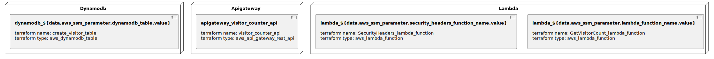

# Cloud Resume Challenge - The Back End

This rep holds the Lambda function code written in Python for my visitor counter, as well as my Terraform HCL code providing Infrastructure as Code for my serverless cloud resume website.

### Infrastructure model

---
